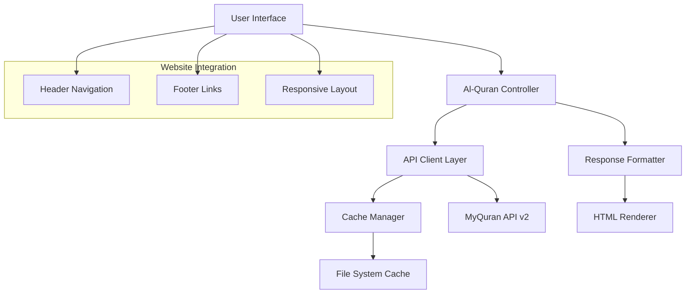

# Design Document: Fitur Al-Quran

## Overview

Fitur Al-Quran adalah sistem yang terintegrasi dengan website masjid untuk menyediakan akses mudah ke teks Al-Quran melalui API MyQuran. Sistem ini dirancang mengikuti pola arsitektur yang sudah ada di website masjid, dengan menggunakan struktur navigasi yang konsisten, sistem caching yang efisien, dan interface yang responsif.

Fitur ini akan memungkinkan jamaah untuk membaca Al-Quran dengan berbagai metode navigasi: per surat dan ayat, per halaman mushaf, per juz, dan pencarian berdasarkan tema. Sistem ini mengintegrasikan API MyQuran v2 yang menyediakan endpoint lengkap untuk mengakses teks Al-Quran.

## Architecture

### High-Level Architecture



### Integration with Existing Website

Fitur Al-Quran akan diintegrasikan ke dalam struktur website yang sudah ada:

1. **Navigation Integration**: Menambahkan menu "Al-Quran" ke dalam header navigation dengan dropdown submenu
2. **URL Structure**: Mengikuti pola `/pages/alquran.php` dengan parameter untuk navigasi
3. **Styling Consistency**: Menggunakan Tailwind CSS dan pola desain yang sudah ada
4. **Caching Pattern**: Mengikuti pola caching yang sama dengan prayer API

## Components and Interfaces

### 1. Al-Quran API Client (`includes/alquran_api.php`)

**Purpose**: Mengelola komunikasi dengan MyQuran API v2 dan caching

**Key Functions**:
```php
// Surat dan Ayat
function getAyatBySurat($surat, $ayat_start, $panjang)
function getAyatByRange($surat, $ayat_start, $ayat_end)

// Halaman dan Juz
function getAyatByPage($page_number)
function getAyatByJuz($juz_number)
function getJuzInfo($juz_number)

// Tema
function getAllTema()
function getTemaById($tema_id)

// Utility
function fetchQuranData($url)
function getCachedData($cache_key)
function setCachedData($cache_key, $data)
```

**API Endpoints Integration**:
- `/quran/ayat/{surat}/{ayat}/{panjang}` - Ayat sepanjang N dari ayat tertentu
- `/quran/ayat/{surat}/{start}-{end}` - Ayat dalam rentang
- `/quran/ayat/page/{page}` - Ayat per halaman mushaf
- `/quran/ayat/juz/{juz}` - Ayat per juz
- `/quran/juz/{juz}` - Informasi juz
- `/quran/tema/{id}` - Tema tertentu
- `/quran/tema/semua` - Semua tema

### 2. Al-Quran Page Controller (`pages/alquran.php`)

**Purpose**: Halaman utama untuk menampilkan Al-Quran dengan berbagai mode navigasi

**URL Parameters**:
- `mode`: surat|page|juz|tema (default: surat)
- `surat`: nomor surat (1-114)
- `ayat`: nomor ayat awal
- `panjang`: jumlah ayat yang ditampilkan
- `range`: format "start-end" untuk rentang ayat
- `page`: nomor halaman mushaf (1-604)
- `juz`: nomor juz (1-30)
- `tema`: ID tema (1-1121)

**Navigation Modes**:
1. **Surat Mode**: `/pages/alquran.php?mode=surat&surat=2&ayat=1&panjang=5`
2. **Page Mode**: `/pages/alquran.php?mode=page&page=1`
3. **Juz Mode**: `/pages/alquran.php?mode=juz&juz=1`
4. **Tema Mode**: `/pages/alquran.php?mode=tema&tema=1`

### 3. Navigation Component (`partials/alquran_navigation.php`)

**Purpose**: Komponen navigasi untuk berpindah antar surat, halaman, juz

**Features**:
- Dropdown selector untuk surat (1-114)
- Input field untuk ayat dan jumlah ayat
- Slider atau input untuk halaman mushaf (1-604)
- Selector untuk juz (1-30)
- Search box untuk tema
- Previous/Next navigation buttons
- Bookmark functionality (localStorage)

### 4. Display Component (`partials/alquran_display.php`)

**Purpose**: Komponen untuk menampilkan teks Al-Quran dengan formatting yang baik

**Features**:
- Arabic text dengan font yang sesuai
- Terjemahan Indonesia (jika tersedia dari API)
- Nomor ayat yang jelas
- Informasi konteks (nama surat, juz, halaman)
- Font size controls
- Copy ayat functionality
- Audio player integration (future enhancement)

### 5. Cache Manager (`includes/alquran_cache.php`)

**Purpose**: Mengelola caching untuk mengurangi API calls

**Caching Strategy**:
- Cache duration: 24 jam untuk data Al-Quran (statis)
- Cache location: `/api/cache/quran_*.json`
- Cache key format: `quran_{endpoint_hash}.json`
- Fallback mechanism jika API tidak tersedia

## Data Models

### Ayat Data Structure
```php
[
    'nomor' => 1,
    'arab' => 'بِسْمِ اللَّهِ الرَّحْمَٰنِ الرَّحِيمِ',
    'latin' => 'Bismillahir rahmanir rahiim',
    'arti' => 'Dengan nama Allah Yang Maha Pengasih, Maha Penyayang',
    'nomor_surat' => 1,
    'nama_surat' => 'Al-Fatihah',
    'juz' => 1,
    'halaman' => 1
]
```

### Surat Information
```php
[
    'nomor' => 1,
    'nama' => 'Al-Fatihah',
    'nama_latin' => 'Al-Fatihah',
    'jumlah_ayat' => 7,
    'tempat_turun' => 'Makkah',
    'arti' => 'Pembukaan'
]
```

### Juz Information
```php
[
    'juz' => 1,
    'surat_mulai' => [
        'nomor' => 1,
        'nama' => 'Al-Fatihah',
        'ayat' => 1
    ],
    'surat_selesai' => [
        'nomor' => 2,
        'nama' => 'Al-Baqarah',
        'ayat' => 141
    ]
]
```

### Tema Information
```php
[
    'id' => 1,
    'nama' => 'Akidah',
    'deskripsi' => 'Ayat-ayat tentang keimanan dan tauhid',
    'jumlah_ayat' => 150,
    'ayat' => [
        // Array of ayat related to this tema
    ]
]
```

## Error Handling

### API Error Handling
1. **Connection Timeout**: Retry mechanism dengan exponential backoff
2. **Invalid Response**: Fallback ke cache atau error message yang user-friendly
3. **Rate Limiting**: Implementasi delay dan queue system
4. **Invalid Parameters**: Validasi input dan error messages yang spesifik

### User Input Validation
```php
function validateSuratNumber($surat) {
    return is_numeric($surat) && $surat >= 1 && $surat <= 114;
}

function validateAyatNumber($surat, $ayat) {
    $max_ayat = getSuratInfo($surat)['jumlah_ayat'];
    return is_numeric($ayat) && $ayat >= 1 && $ayat <= $max_ayat;
}

function validatePageNumber($page) {
    return is_numeric($page) && $page >= 1 && $page <= 604;
}

function validateJuzNumber($juz) {
    return is_numeric($juz) && $juz >= 1 && $juz <= 30;
}
```

### Error Messages
- **Surat tidak valid**: "Nomor surat harus antara 1-114"
- **Ayat tidak valid**: "Nomor ayat tidak valid untuk surat ini"
- **Halaman tidak valid**: "Nomor halaman harus antara 1-604"
- **Juz tidak valid**: "Nomor juz harus antara 1-30"
- **API tidak tersedia**: "Layanan Al-Quran sedang tidak tersedia, silakan coba lagi nanti"

## Testing Strategy

### Unit Tests
- Test API client functions dengan mock responses
- Test input validation functions
- Test cache management functions
- Test data formatting functions

### Integration Tests
- Test API integration dengan MyQuran API
- Test caching mechanism
- Test error handling scenarios
- Test navigation between different modes

## Correctness Properties

*A property is a characteristic or behavior that should hold true across all valid executions of a system-essentially, a formal statement about what the system should do. Properties serve as the bridge between human-readable specifications and machine-verifiable correctness guarantees.*

### Property 1: Surat and Ayat Retrieval Accuracy
*For any* valid surat number (1-114) and ayat number within that surat's range, when requesting specific ayat, the system should return the correct ayat data with accurate Arabic text, translation, and metadata
**Validates: Requirements 1.1, 1.2, 1.3**

### Property 2: Input Parameter Validation
*For any* input parameters (surat, ayat, page, juz, tema), the system should accept all valid values within their respective ranges (surat: 1-114, page: 1-604, juz: 1-30, tema: 1-1121) and reject all invalid values with specific error messages
**Validates: Requirements 1.4, 1.5, 2.2, 3.3, 4.3, 7.1, 7.3**

### Property 3: Page and Juz Navigation Consistency
*For any* valid page number (1-604) or juz number (1-30), the system should return all ayat contained within that page or juz, and the returned ayat should maintain proper sequence and completeness
**Validates: Requirements 2.1, 3.1, 3.2, 3.4**

### Property 4: Tema Search and Retrieval
*For any* valid tema ID (1-1121), the system should return tema information and all related ayat, ensuring that the ayat are relevant to the tema's topic
**Validates: Requirements 4.2**

### Property 5: API Response and Cache Management
*For any* API request, if the response is successful, the system should cache the data and use cached data for subsequent identical requests within the cache validity period, and if API fails, the system should attempt to use cached data as fallback
**Validates: Requirements 5.1, 5.3, 5.4, 5.5, 7.4**

### Property 6: Error Handling Consistency
*For any* error condition (invalid input, API failure, timeout), the system should return appropriate error messages that are user-friendly and provide actionable guidance, and all errors should be logged for debugging purposes
**Validates: Requirements 2.3, 5.2, 7.2, 7.5**

### Property 7: Navigation Interface Completeness
*For any* navigation mode (surat, page, juz, tema), the system should display the appropriate input form and navigation controls, and context information should always be visible
**Validates: Requirements 6.2, 6.4**

### Property-Based Tests
The system will use property-based testing to validate these correctness properties across many generated inputs. Each property test will run a minimum of 100 iterations to ensure comprehensive coverage of the input space.

**Testing Framework**: PHPUnit with custom property-based testing generators

**Test Configuration**:
- Minimum 100 iterations per property test
- Each property test references its design document property
- Tag format: **Feature: fitur-alquran, Property {number}: {property_text}**

**Smart Generators**:
- Surat generator: Creates valid surat numbers (1-114) with corresponding ayat counts
- Ayat generator: Creates valid ayat numbers based on selected surat
- Page generator: Creates valid page numbers (1-604)
- Juz generator: Creates valid juz numbers (1-30)
- Tema generator: Creates valid tema IDs (1-1121)
- Invalid input generator: Creates boundary and out-of-range values for negative testing

### Unit Tests
Unit tests will complement property-based tests by focusing on:

**Specific Examples**:
- Test well-known ayat (e.g., Al-Fatihah 1:1, Ayat Kursi 2:255)
- Test boundary cases (first and last ayat of each surat)
- Test specific error scenarios

**Integration Points**:
- API client integration with MyQuran API
- Cache file operations
- Navigation component interactions
- Display formatting functions

**Edge Cases**:
- Empty API responses
- Malformed JSON responses
- Network timeout scenarios
- Cache corruption handling

**Error Conditions**:
- Invalid parameter combinations
- API rate limiting responses
- File system permission errors
- Memory limit scenarios

The testing approach ensures both comprehensive coverage through property-based testing and specific validation through targeted unit tests, providing confidence in the system's correctness and reliability.