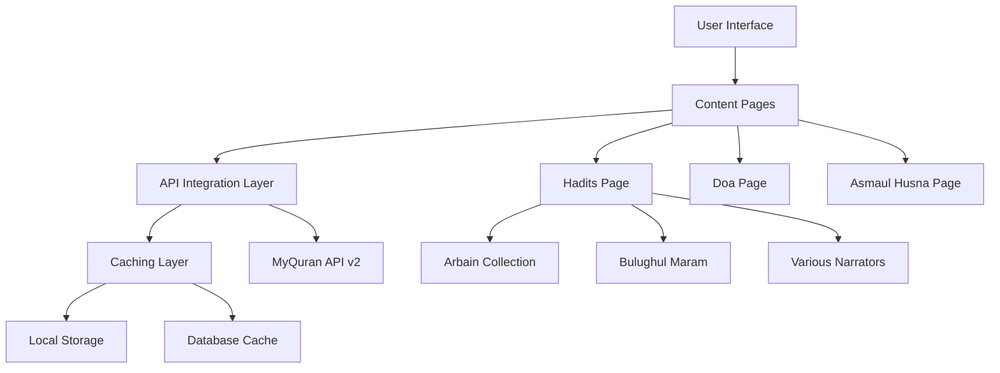

# Design Document - MyQuran API Integration

## Overview

This design document outlines the implementation of MyQuran API integration to add Hadits, Doa, and Asmaul Husna features to the existing Islamic content management system. The solution will create dedicated pages for each content type while maintaining consistency with the existing Al-Quran interface.

## Architecture

### High-Level Architecture



### System Components

1. **Frontend Pages**: Dedicated PHP pages for each content type
2. **API Integration Layer**: PHP classes for MyQuran API communication
3. **Caching System**: Multi-level caching for performance optimization
4. **Content Display Components**: Reusable UI components for Islamic content
5. **Navigation Integration**: Updates to main navigation system

## Components and Interfaces

### 1. API Integration Classes

#### MyQuranAPI Class
```php
class MyQuranAPI {
    private $baseUrl = 'https://api.myquran.com/v2';
    private $cache;
    private $rateLimiter;
    
    public function getHaditsArbain(int $nomor): array
    public function getHaditsBulughulMaram(int $nomor): array
    public function getHaditsPerawi(string $slug, int $nomor): array
    public function getRandomHadits(): array
    public function getDoa(int $id): array
    public function getRandomDoa(): array
    public function getDoaSumber(): array
    public function getAsmaulHusna(int $nomor): array
    public function getRandomAsmaulHusna(): array
    public function getAllAsmaulHusna(): array
}
```

#### CacheManager Class
```php
class MyQuranCacheManager {
    private $cacheDir = 'cache/myquran/';
    private $cacheExpiry = 86400; // 24 hours
    
    public function get(string $key): ?array
    public function set(string $key, array $data, int $ttl = null): bool
    public function delete(string $key): bool
    public function clear(): bool
    public function isExpired(string $key): bool
}
```

#### RateLimiter Class
```php
class APIRateLimiter {
    private $maxRequests = 100;
    private $timeWindow = 3600; // 1 hour
    
    public function canMakeRequest(): bool
    public function recordRequest(): void
    public function getRemainingRequests(): int
    public function getResetTime(): int
}
```

### 2. Content Display Components

#### IslamicContentRenderer Class
```php
class IslamicContentRenderer {
    public function renderHadits(array $hadits): string
    public function renderDoa(array $doa): string
    public function renderAsmaulHusna(array $asma): string
    public function renderArabicText(string $text): string
    public function renderTranslation(string $text): string
    public function renderSource(array $source): string
}
```

### 3. Page Controllers

#### HaditsController
- Handles hadits page routing and content display
- Manages different hadits collections (Arbain, Bulughul Maram, Perawi)
- Implements pagination and search functionality

#### DoaController
- Manages doa page content and categorization
- Handles doa source filtering and search
- Implements random doa feature

#### AsmaulHusnaController
- Controls Asmaul Husna page display
- Manages grid/list view options
- Handles individual name detail views

## Data Models

### Hadits Data Structure
```json
{
  "status": true,
  "request": {
    "path": "/hadits/arbain/1",
    "id": "1"
  },
  "data": {
    "arab": "Arabic text",
    "indo": "Indonesian translation",
    "nomor": 1,
    "judul": "Title",
    "source": "arbain",
    "perawi": "Narrator name"
  }
}
```

### Doa Data Structure
```json
{
  "status": true,
  "request": {
    "path": "/doa/1",
    "id": "1"
  },
  "data": {
    "arab": "Arabic text",
    "indo": "Indonesian translation",
    "judul": "Title",
    "source": "harian"
  }
}
```

### Asmaul Husna Data Structure
```json
{
  "status": true,
  "request": {
    "path": "/husna/1",
    "id": "1"
  },
  "data": {
    "arab": "الرَّحْمـٰنُ",
    "id": 1,
    "indo": "Yang Maha Pengasih",
    "latin": "Ar-Rahmânu"
  }
}
```

## Correctness Properties

*A property is a characteristic or behavior that should hold true across all valid executions of a system-essentially, a formal statement about what the system should do. Properties serve as the bridge between human-readable specifications and machine-verifiable correctness guarantees.*

### Property 1: API Integration Reliability
*For any* valid API endpoint and parameters, the system should successfully retrieve data or provide appropriate error handling with fallback content.
**Validates: Requirements 1.3, 1.4, 1.5, 2.2, 3.2, 4.1**

### Property 2: Content Display Completeness
*For any* retrieved Islamic content (hadits, doa, asmaul husna), the display should include all required fields (Arabic text, translation, source information) when available in the API response.
**Validates: Requirements 1.6, 2.3, 3.3, 6.1, 6.4**

### Property 3: Random Content Functionality
*For any* random content request (hadits, doa, asmaul husna), the system should return different content on subsequent calls and handle the randomization properly.
**Validates: Requirements 1.7, 2.5, 3.4**

### Property 4: Caching Consistency
*For any* API request, if the same request is made within the cache expiry period, the system should return cached data without making additional API calls.
**Validates: Requirements 4.2, 4.7**

### Property 5: Error Handling Robustness
*For any* API failure or invalid response, the system should display appropriate error messages and provide fallback content or recovery options without crashing.
**Validates: Requirements 1.8, 4.3, 4.6, 5.6**

### Property 6: Search and Filter Functionality
*For any* search query or filter criteria, the system should return only content that matches the specified criteria and handle empty results gracefully.
**Validates: Requirements 2.6, 2.7, 3.8, 6.7**

### Property 7: Content Formatting Consistency
*For any* Arabic text content, the system should apply proper RTL formatting, appropriate fonts, and maintain consistent styling across all content types.
**Validates: Requirements 6.1, 6.2**

### Property 8: Copy and Share Functionality
*For any* displayed content, the copy and share features should work correctly and include all relevant information (Arabic text, translation, source).
**Validates: Requirements 2.8, 6.3**

### Property 9: Navigation and Accessibility
*For any* page navigation or keyboard interaction, the system should provide proper focus management, ARIA labels, and accessible navigation paths.
**Validates: Requirements 5.7, 5.8**

### Property 10: Performance Requirements
*For any* content loading operation under normal conditions, the system should complete within the specified time limits and provide loading indicators.
**Validates: Requirements 7.1, 7.2**

### Property 11: Rate Limiting Compliance
*For any* sequence of API requests, the system should respect rate limiting policies and prevent excessive API calls that could violate usage terms.
**Validates: Requirements 4.4**

### Property 12: Responsive Design Behavior
*For any* screen size or device type, the content should display properly with appropriate layout adjustments and maintain usability.
**Validates: Requirements 5.3**

## Error Handling

### API Error Scenarios
1. **Network Connectivity Issues**: Display cached content with offline notice
2. **API Rate Limiting**: Implement exponential backoff and user notification
3. **Invalid API Responses**: Validate responses and show error messages
4. **Content Not Found**: Provide helpful error messages and navigation options
5. **Server Errors**: Log errors and display fallback content

### Error Recovery Strategies
1. **Automatic Retry**: Implement retry logic with exponential backoff
2. **Graceful Degradation**: Show partial content when some features fail
3. **User Feedback**: Provide clear error messages and recovery actions
4. **Logging**: Comprehensive error logging for debugging and monitoring

## Testing Strategy

### Unit Testing
- Test API integration classes with mock responses
- Test caching mechanisms with various scenarios
- Test content rendering with different data structures
- Test error handling with simulated failures

### Property-Based Testing
- Test API integration reliability across all endpoints
- Test content display completeness with generated data
- Test caching behavior with various request patterns
- Test error handling with random failure scenarios
- Test search and filter functionality with diverse inputs

### Integration Testing
- Test complete user workflows from navigation to content display
- Test API integration with real MyQuran API endpoints
- Test caching integration with database and file systems
- Test responsive design across different devices and browsers

### Performance Testing
- Test page load times under various network conditions
- Test API response times and caching effectiveness
- Test memory usage with large content collections
- Test concurrent user scenarios

### Accessibility Testing
- Test keyboard navigation across all pages
- Test screen reader compatibility
- Test color contrast and visual accessibility
- Test mobile accessibility features

The testing approach ensures comprehensive coverage of both functional requirements and system reliability, with particular emphasis on API integration robustness and user experience quality.